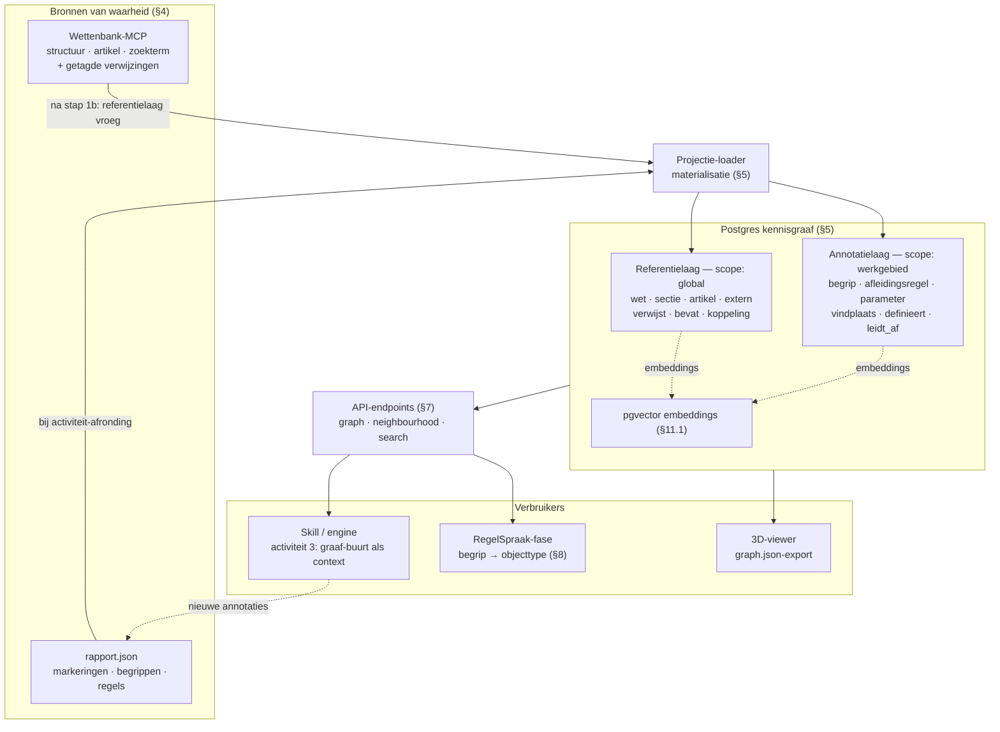
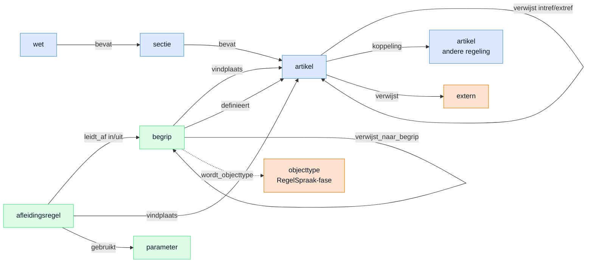

# Kennisgraaf als GraphRAG-substraat voor de wetsanalyse — ontwerp

> **Status:** ontwerp ter besluitvorming (geen code). Doel: vastleggen hoe de losse
> `tools/kennisgraaf` en de wetsanalyse-annotaties tot één traceerbare kennisgraaf kunnen
> samenkomen, hoe die in de API/Postgres landt en hoe retrieval erover loopt — zónder de
> brongetrouwheid of de human-in-the-loop op te geven.
>
> Leeswijzer: §1–§2 motiveren en inventariseren, §3–§4 leggen het schema en de
> bron-van-waarheid vast, §5–§8 zijn de architectuurkeuzes, §9–§10 zijn risico's en
> migratiepad. §11 bevat de **vastgestelde keuzes** (de eerder open beslispunten zijn besloten;
> de secties hieronder zijn daarop bijgewerkt).

## 1. Probleem & visie

Vandaag staan twee dingen los van elkaar:

- de **wetsanalyse** produceert per werkgebied een `rapport.json` met markeringen (JAS-klassen),
  begrippen en afleidingsregels — een rijk geannoteerd, maar *plat* artefact (lijsten in JSON);
- de **`kennisgraaf`** materialiseert de *verwijzingenstructuur* tussen artikelen (intref/extref/
  structuur) als een 3D-graaf, maar weet niets van de annotaties.

De visie: breng beide samen tot **één kennisgraaf** waarin artikelen, secties, begrippen en
regels knopen zijn en hun relaties (verwijst, bevat, definieert, leidt-af) kanten. Dan kun je:

1. een werkgebied **mede bepalen** via de graaf (seed-bron → relevante buurt);
2. de **annotaties op de knopen** opslaan (artikel-knoop draagt zijn markeringen; begrip wordt
   een eigen knoop);
3. bij activiteit 3 **rijkere begrippen** vormen doordat de relaties bekend zijn (homoniemen
   splitsen, synoniemen samenvoegen en begrip→begrip-relaties zijn relatie-beslissingen);
4. **efficiënt zoeken** over de graaf voor relationele vragen.

Dit is het **GraphRAG**-patroon: een kennisgraaf als retrieval-substraat naast (niet in plaats
van) tekstueel zoeken. De winst zit niet in "een graaf om de graaf", maar in betere context
voor begripsvorming en in relationele queries die plat-JSON niet goedkoop beantwoordt.

### Architectuur in één plaat

*Lees de plaat als een cyclus:* de MCP-wettekst en het `rapport.json` voeden via de
projectie-loader de Postgres-graaf (objectieve referentielaag gedeeld, interpretatieve
annotatielaag per werkgebied); de API ontsluit die graaf voor de skill/engine, de RegelSpraak-fase
en de viewer; en de analyse die de skill produceert vult het `rapport.json` weer aan — waarna de
graaf wordt bijgewerkt.

## 2. De latente graaf die er al ligt

Cruciaal: dit is geen nieuwbouw. Het datamodel ís al een graaf — we maken hem alleen expliciet.

| Bestaande structuur | Bestand | Graaf-equivalent |
|---|---|---|
| `Verwijzing` (artikel → JCI-doel, intref/extref) | `api/app/contracts.py`, `tools/wettenbank-mcp` | kant `verwijst` (artikel→artikel/extern) |
| `Begrip.verwijst_naar_begrippen` (begrip-id's in de omschrijving) | `api/app/contracts.py` | kant `verwijst_naar_begrip` (begrip→begrip) |
| `Begrip.bron_verwijzing` (id van de definitie-verwijzing) | `api/app/contracts.py` | kant `definieert` (begrip→artikel/definitie) |
| `Begrip.vindplaatsen` / `Afleidingsregel.vindplaatsen` (`[{bron_id, lid}]`) | `api/app/contracts.py` | kant `vindplaats` (begrip/regel→artikel+lid) |
| `Markering` (JAS-klasse op een lid) | `api/app/contracts.py` | annotatie op de artikel-knoop |
| referentielaag (intref/extref/koppeling/structuur) | `tools/kennisgraaf/extract.ts` | knopen `artikel/sectie/wet/extern` + kanten |
| scoping-beleid (diepte-cap 1 + relevantie-gate, bounded delegaties) | `.claude/skills/wetsanalyse/references/verwijzingen-volgen.md` | graaf-gestuurde werkgebied-scoping |
| begrippen als objectmodel (`gegevensspraak`: objecttypen/feittypen) | `RegelspraakModel` in `api/app/contracts.py` | begrip-knoop → objecttype-knoop |

Met andere woorden: de **referentielaag** (kennisgraaf) en de **annotatielaag** (rapport) zijn
twee projecties van dezelfde onderliggende graaf. Het ontwerp koppelt ze via één schema (§3).

## 3. Canoniek graafschema

Eén schema dat beide lagen dekt. Knoop- en kanttypen zijn afgeleid uit bestaande velden — geen
verzonnen entiteiten.

*Blauw = referentielaag (`scope=global`), groen = annotatielaag (`scope=werkgebied`), oranje =
extern/afgeleid.* De gestippelde `wordt_objecttype`-kant is de brug naar de RegelSpraak-fase (§8).

### Knooptypen

| Type | Herkomst | Sleutel (voorstel) | Belangrijkste annotaties |
|---|---|---|---|
| `wet` | regeling (bwbId) | `wet:{bwbId}` | citeertitel, versiedatum |
| `sectie` | structuur (hoofdstuk/…/circulaire_divisie) | `{bwbId}#{type}-{nr}` | titel, sectietype |
| `artikel` | `Bron` / intern artikel | `jci1.3:c:{bwbId}&artikel={nr}` | leden-tekst, **markeringen (JAS)**, pad, bronreferentie |
| `extern` | verwijzing naar andere regeling | ruwe JCI of bwbId | label, doel-bwbId |
| `begrip` | `Begrip` | `begrip:{werkgebied}:{id}` | naam, synoniemen, klasse, definitie, interpretatie-vlag |
| `afleidingsregel` | `Afleidingsregel` | `regel:{werkgebied}:{id}` | type (beslis/reken/specialisatie), uitvoer/invoer |
| `parameter` | regel-parameters | `param:{…}` | waarde, geldigheidsperiode |

### Kanttypen

| Type | Van → naar | Herkomst |
|---|---|---|
| `verwijst` (intref/extref) | artikel → artikel/extern | `Verwijzing` / mcp-verwijzingen |
| `koppeling` | artikel → artikel (andere regeling in de set) | cross-regeling-verwijzing |
| `bevat` (structuur) | wet → sectie → artikel | structuurboom |
| `vindplaats` | begrip/regel → artikel(+lid) | `vindplaatsen` |
| `definieert` | begrip → artikel/definitie | `bron_verwijzing` |
| `verwijst_naar_begrip` | begrip → begrip | `verwijst_naar_begrippen` |
| `leidt_af` (in/uit) | afleidingsregel → begrip/variabele | regel-in/uitvoer |
| `wordt_objecttype` (toekomst) | begrip → objecttype | RegelSpraak-fase |

**Provenance is verplicht op elke knoop en kant.** Een artikel-knoop draagt zijn `bronreferentie`
(lid- en versiespecifieke jci); een begrip/regel-knoop draagt zijn `vindplaatsen`. Zonder
herleidbare bron komt een knoop er niet in.

## 4. Bron van waarheid & brongetrouwheid

De graaf is **een afgeleide materialisatie**, nooit een zelfstandige feitenbron. Twee voedende
bronnen:

1. de **MCP-wettekst** + getagde verwijzingen (`wettenbank_structuur`/`_artikel`) — de
   referentielaag en de letterlijke tekst;
2. de **`Rapport`-artefacten** (markeringen/begrippen/regels) — de annotatielaag.

Onverhandelbare regels (in lijn met `CLAUDE.md`):

- **Geen tekstgeneratie uit de graaf.** De graaf verrijkt *retrieval/context*; wettekst komt
  altijd letterlijk van de MCP.
- **Elk verrijkt begrip blijft citeren** met jci-vindplaats; een graaf-gesuggereerde relatie is
  een *hypothese voor de analist*, geen vaststaand feit.
- **Herbouwbaar.** De graaf is op elk moment volledig te reconstrueren uit (1) en (2); hij mag
  weggegooid en opnieuw opgebouwd worden zonder informatieverlies. Dat is meteen de
  veiligheidsklep: raakt de graaf "vies", dan herbouwen we hem uit de artefacten.

## 5. Materialisatie & opslag

**Besloten: Postgres node/edge-tabellen (de bestaande jobstore), géén Neo4j.** De API draait al
op Postgres (`api/app/postgres_store.py`, `JobStore`-Protocol) en de ops is bewust
minimalistisch (OpenShift, weinig deps). Een aparte graafdatabase voegt een hele operationele
dimensie toe voor een graaf die klein is (orde 10³–10⁴ knopen) en die we toch uit artefacten
afleiden.

Schema (voorstel):

- **`graph_nodes`** — `id` (sleutel uit §3), `type`, `scope` (`global` voor de referentielaag of
  `werkgebied:{id}` voor de annotatielaag — zie §11.4), `payload` JSONB (label, annotaties),
  `provenance` (bronreferentie/jci), `embedding` `vector` (pgvector, §11.1).
- **`graph_edges`** — `bron`, `doel`, `soort` (§3), `scope`, `payload` JSONB, `provenance`.
- Recursieve buurt-/k-hops-queries via `WITH RECURSIVE`; index op (`scope`, `type`) en op
  (`bron`, `soort`).

**pgvector is in scope** (besloten): een `embedding`-kolom op `graph_nodes` voor knoop-tekst
(artikel-leden, begripsomschrijvingen) → hybride retrieval (§6). Vergt de pgvector-extensie en
een embedding-stap bij materialisatie; modelkeuze sluit aan op de bestaande modelprofielen.

De **scheiding referentielaag (`global`) vs. annotatielaag (`werkgebied:…`)** via de `scope`-kolom
realiseert de hybride keuze uit §11.4: objectieve, wet-afgeleide knopen/kanten worden gedeeld;
interpretatieve (begrippen/regels) blijven per werkgebied.

Het herbouwbare `graph.json`-artefact (zoals de huidige `kennisgraaf`) blijft bestaan als
**export/visualisatie-projectie** van de tabellen — niet als primaire opslag.

## 6. Retrieval & zoeken (GraphRAG, hybride)

De graaf vervangt tekstueel zoeken **niet**; hij vult het aan. Drie complementaire kanalen:

| Vraagtype | Kanaal |
|---|---|
| Relationeel ("alle begrippen die regel X voeden", "artikelen binnen 2 hops van art. 25", "wat definieert begrip Y") | **graaf-traversal** (goedkoop, exact) |
| Nieuwe tekst vinden op term/wildcard | **MCP `wettenbank_zoekterm`** (full-text in een wet) |
| Semantisch/"lijkt op" | **pgvector** (in scope, §11.1) — embeddings op knoop-tekst |

**Werkgebied-scoping via de graaf.** Reuse het bestaande 1b-beleid
(`verwijzingen-volgen.md`): seed-bron → uitgaande verwijzingen → diepte-cap 1 +
relevantie-gate, delegaties bounded. De graaf maakt dit *zichtbaar en herbruikbaar*: een
voorgestelde buurt die de **analist bevestigt**. De graaf bepaalt het werkgebied dus niet
autonoom — hij stelt voor, de mens beslist.

## 7. Integratie met de skill-flow & de API

Waar het "samenkomt", zonder bestaande contracten te breken:

- **Skill/engine (activiteit 3).** Vóór begripsvorming krijgt het model de **graaf-buurt** van de
  betrokken bronnen als extra context: welke artikelen verwijzen naar een definitie, welke
  begrippen co-occurren, welke regels een variabele gebruiken. Dit is *aangereikte context*,
  geen nieuw veld in het annotatiecontract — `contracts.py` blijft ongewijzigd. De winst:
  betere homoniem-/synoniem-beslissingen en begrip→begrip-relaties (precies de dingen die
  `begrippen-en-afleidingsregels-opstellen.md` al vraagt).
- **API.** Na rapport-afronding materialiseert de API de graaf (§5-variant B) en biedt
  lees-/zoek-endpoints, schetsmatig:
  - `GET /v1/projects/{id}/graph` — knopen/kanten (voor de viewer en voor clients);
  - `GET /v1/projects/{id}/graph/neighbourhood?seed=…&hops=1` — bounded buurt (scoping/RAG);
  - `POST /v1/projects/{id}/graph/search` — graaf-gescopet zoeken (hybride met MCP/pgvector).
  Dit sluit aan op de bestaande project-routers (`api/app/routers/projects.py`) en de
  jobstore; geen nieuwe runtime-afhankelijkheid behalve (optioneel) pgvector.

## 8. Begrip-als-knoop & de brug naar RegelSpraak

Een begrip-knoop is de natuurlijke voorloper van een **objecttype/feittype** in
`RegelspraakModel.gegevensspraak`. De graaf maakt die overgang expliciet en traceerbaar: de
`leidt_af`- en `verwijst_naar_begrip`-kanten uit de analysefase mappen op de objecttype-/
feittype-relaties van GegevensSpraak. Zo wordt de regelspraak-fase niet een herinterpretatie
maar een *projectie* van dezelfde graaf — met behoud van herkomst (de `herkomst`-velden die de
regelspraak-skill al kent).

## 9. Risico's & niet-doelen

- **Geen autonome werkgebied-bepaling.** De graaf stelt scope voor; de analist bevestigt. De
  review-checkpoints blijven.
- **Geen hallucinatie-oppervlak.** De graaf levert relaties en context, geen wettekst of
  "feiten". Alles blijft jci-herleidbaar.
- **Geen Neo4j / geen zware ops.** Postgres dekt het; de graaf blijft klein en herbouwbaar.
- **Geen big-bang.** Geen refactor van de skill- of API-contracten vooraf; de graaf is eerst
  additief (context + visualisatie), pas later een API-substraat.
- **Geen vendor-/embeddings-lock-in vooraf.** pgvector is optioneel en losjes gekoppeld.

## 10. Gefaseerd migratiepad

Elke fase is los te keuren en levert op zichzelf waarde. De opslag is vanaf fase 0 al
Postgres-georiënteerd (besluit §11.2); het `graph.json` blijft als visuele export.

- **Fase 0 — Projectie + schema (PoC).** Definieer de `graph_nodes`/`graph_edges`-tabellen (§5)
  en een **projectie-loader** die (a) de referentielaag uit de MCP en (b) een bestaand
  `rapport.json` (begrip-/regel-knopen + kanten) naar die tabellen schrijft, met `scope`
  (`global` vs. `werkgebied:…`). Visuele controle via een `graph.json`-export naar de bestaande
  viewer. Raakt de skill-/analyse-contracten niet (alleen lezen).
- **Fase 1 — Vroege materialisatie + graaf-buurt als context.** Materialiseer de referentielaag
  direct na stap 1b (besluit §11.5) en voed de **bounded buurt** (1b-beleid) als extra context
  in de skill/engine bij activiteit 3. Annotatielaag bij activiteit-afronding bijwerken. Meet of
  begrippen rijker/consistenter worden.
- **Fase 2 — API-substraat + hybride zoek.** Read-/zoek-endpoints (§7) op de tabellen; **pgvector**
  erbij (besluit §11.1) voor semantische knoop-zoek naast graaf-traversal en MCP-`zoekterm`.
- **Fase 3 — Werkgebied-suggestie.** Graaf-gestuurde scope-voorstellen voor een *nieuwe* analyse
  (seed → gedeelde referentielaag → voorgestelde bronnen), analist bevestigt.

## 11. Vastgestelde keuzes

De eerder open beslispunten zijn besloten; §5/§6/§10 zijn hierop bijgewerkt.

| # | Beslispunt | Keuze | Korte motivatie |
|---|---|---|---|
| 11.1 | Semantisch zoeken (pgvector) | **Nu meenemen** | `embedding`-kolom op `graph_nodes`; hybride zoek vanaf fase 2 naast graaf-traversal + MCP-`zoekterm`. |
| 11.2 | Opslag | **Direct Postgres node/edge-tabellen** | Vanaf fase 0; `graph.json` blijft als visuele export, niet als primaire opslag. |
| 11.3 | Reikwijdte graaf-zoek | **Aanvullen, niet vervangen** | De graaf bevat alleen gematerialiseerde tekst; nieuwe tekst vinden blijft MCP-`zoekterm`. |
| 11.4 | Scope van de graaf | **Hybride** | Referentielaag `scope=global` (gedeeld); annotatielaag `scope=werkgebied:…` (per analyse). Cross-werkgebied begrip-hergebruik later opt-in mét conflictafhandeling. |
| 11.5 | Wanneer materialiseren | **Vroeg + bij afronding** | Referentielaag direct na stap 1b (ondersteunt begripsvorming live); annotatielaag bij activiteit-afronding. Geen per-ronde herbouw. |

Nog open voor een latere fase: de governance van **cross-werkgebied begrip-hergebruik**
(definitie-conflicten, versies, peildata) zodra de annotatielaag gedeeld wordt — bewust
uitgesteld tot na fase 2.
